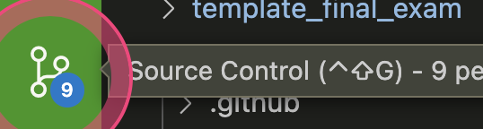

`print('hello world')`

```java
print('hello world')
num = 10
if num < 5:
    print('Number is less than 5.')
else:
    print('Number is greater than 5.')
```

---

[Clickable Link](https://cbc.ca)



| Fruit      | Colour | Shape   | Size   |
| ---------- | ------ | ------- | ------ |
| Apple      | Red    | Sphere  | Medium |
| Strawberry | Red    | Cone    | Small  |
| Pineapple  | Yellow | Ellipse | Big    |
| Kiwi       | Green  | Ellipse | Small  |
